Ascendendo
==========

Introdução
----------

Feito do ponto de vista da Incauta; elementos são mencionados conforme ela toma contato com eles.

.. image:: https://github.com/blouco/openblouco/blob/main/docs/diagramas/blouco.png?raw=true
  :width: 400px
  :align: center

Diagrama sendo desenvolvido no `diagrams.net`_
e salvos no `repositório git`_.

.. _diagrams.net: https://diagrams.net
.. _repositório git: https://github.com/blouco/openblouco

Imagens: `Ten Ox-herding Pictures`_, por Yokō Tatsuhiko; `CBD Tarot de Marseille`_, por Yoav Ben-Dov

.. _Ten Ox-herding Pictures: https://terebess.hu/english/oxherding.html
.. _CBD Tarot de Marseille: http://www.cbdtarot.com/download/

Pelo Mundo
----------

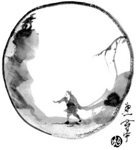

Incauta navega pelas redes

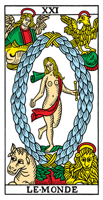

.. youtube:: uHPNehDU0UE
  :width: 420

Link Divulgado
--------------

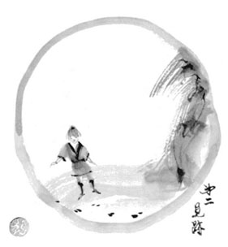

Link aponta a Rua.

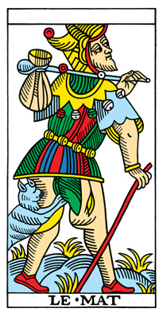

.. youtube:: wwupfkJubNk
  :width: 420

Aproxima-se da Rua
------------------

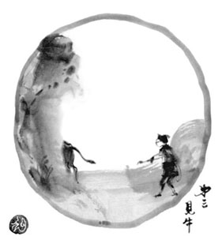

A Rua é um site simples, onde há:

- um web player para transmitir o Trio

- um documento somente leitura, contendo:
    - Calorosas boas vindas
    - Introdução à ideia do Blouco
    - Link para entrar no Papo

- se possível, um embed do Papo no próprio site para facilitar o acesso.

O Trio é um streaming audiovisual, com gestão centralizada em uma pessoa, mas podendo ser distribuída em diversas fontes alternadas, coordenadas por uma ou mais Mixers. É organizada através de seu próprio ambiente.

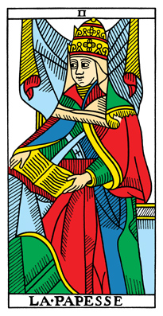

.. youtube:: 1hezI7JzyH0
  :width: 420

Entra no Papo
-------------

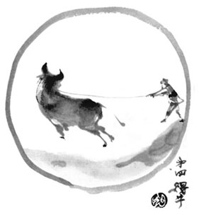

O Papo é uma plataforma *chat* onde as pessoas possam escolher apelidos e haja mecanismos de moderação, feita coletivamente por Cordões.

A Incauta pode tornar-se Cordão através de um mecanismo ainda a ser definido.

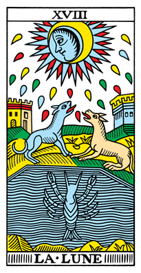

.. youtube:: T85tj-5ed6s
  :width: 420

Torna-se Cordão
---------------

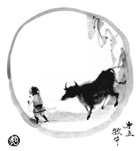

Um canal separado da plataforma utilizada para o Papo será destinada para quem voluntariar-se como Cordão, tendo a tarefa de ajudar a manter o ambiente em segurança e também de servir de "membrana" para o Trio e o Bonde Semente, com algum mecanismo simples de convite ou veto (e.g. 2 pessoas precisam autorizar), ou critério colaborativo.

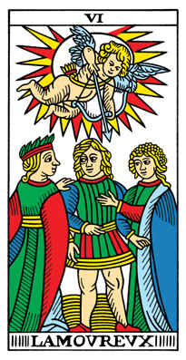

.. youtube:: -QPGp7tih_U
  :width: 420

Dentro do Bonde Semente
-----------------

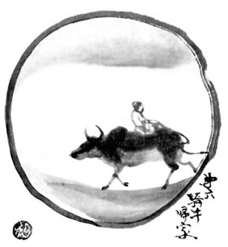

O Bonde Semente é uma sala de videoconferência, onde as pessoas podem interagir por vídeo e/ou áudio, em paralelo à música do Trio.

Suas moderação a princípio é autogerida, mas deve haver protocolos simples de emergência em caso de ataques.

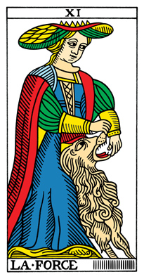

.. youtube:: ZS_-t9TBoqs
  :width: 420

Vendo o Estandarte
------------------

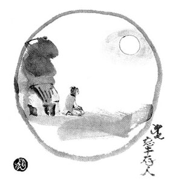

O Estandarte é a central de organização e planejamento de todo o Blouco, de onde saem os links de organização do Trio, do Cordão.  O link de acesso somente-leitura é colado periodicamente no chat do Bonde Semente.

Ele é acessado em modo somente-leitura pelo Trio e pelo Bonde Semente e ajuda a organizá-los, e acessível com escrita pela Porta-Estandarte.

As funções do papel de Porta-estandarte são:

- Manter o documento Estandarte atualizado
- Fazer a costura e assegurar que tudo vai bem entre os diferentes documentos e salas 
- Gerar informações para a criação de um novo Estandarte 

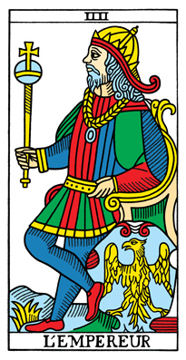

.. youtube:: CqKmB4Bt1Ks
  :width: 420

Sendo Estandarte
----------------

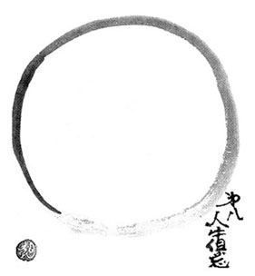

O acesso com escrita do documento do Estandarte é liberado para todos do Cordão.  Após um tempo de interação com o documento, seu conteúdo é passado pela Porta-Estandarte através de um Hash MD5, cujo conteúdo será usado como semente para o sorteio das palavras de geração do próximo Estandarte.

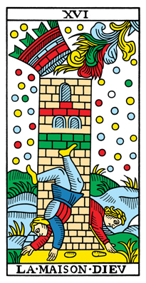

.. youtube:: G1yukIKhzw0
  :width: 420

Gerando novo Estandarte
-----------------------

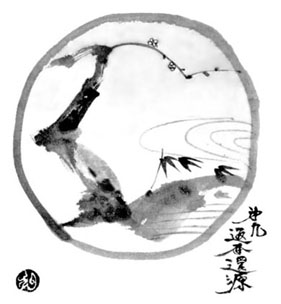

A base de início de um Estandarte é uma "senha" de N (a definir) palavras escolhidas da `lista Diceware`. Seus componentes são utilizados para criar:

.. _`lista Diceware`: https://github.com/ulif/diceware/blob/master/diceware/wordlists/wordlist_pt-br.txt

- O nome do documento do próximo Estandarte
- O nome da stream de transmissão do Trio
- O nome do ambiente do Bonde Semente
- Uma arte composta de "visual hashes" / "identicons" relacionados à frase, a imagem-símbolo do próximo Estandarte

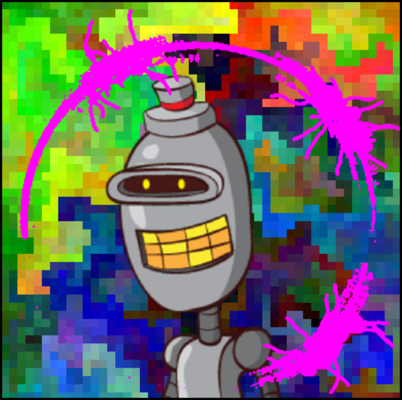

  Composição de Robohash.org, arrival_logograms e Vizhash a partir do texto "blouco"

O método mais prático para sortear as palavras é colar a lista no serviço `Random.org Lists`_, e configurar as opções avançadas para utilizar o conteúdo do Hash como semente (*seed*) do algoritmo de sorteio.

.. _Random.org Lists: https://www.random.org/lists/?mode=advanced

Após sortear as palavras, a Porta-Estandarte constrói o novo Estandarte e os outros componentes iniciais necessários do Blouco, e transmite o link somente-leitura do Cordão para todes.

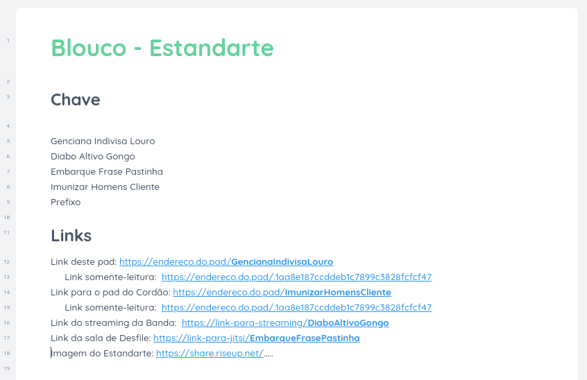

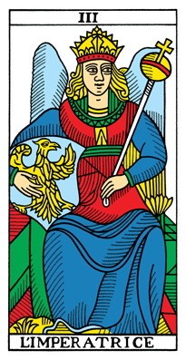

.. youtube:: Rp7yR8g4Jb8
  :width: 420

Retorno ao Mundo
----------------

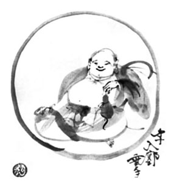

Incauta volta para as redes, falando sobre o Blouco e anunciando o link do próximo Estandarte.

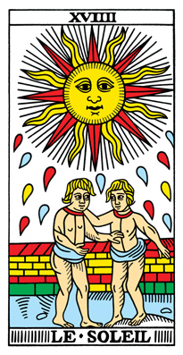

.. youtube:: aLUqvPKG6bU
  :width: 420
