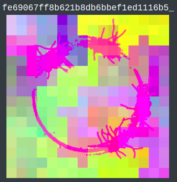
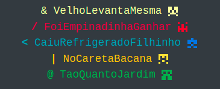
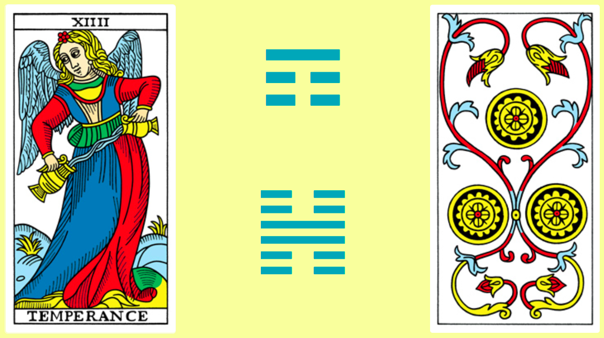

.. _HashFolia:

HashFolia
=========

O `HashFolia <https://bloucos.art/hash/>`__ recebe um texto como semente de entropia para gerar um Selo, uma Sorte, 

Elementos que darão forma a um :ref:`Blouco`.

Pode ser usado meramente como divinação, mas especialmente para a criação de um

Seu uso lhe consagra uma :ref:`Porta-estandarte`.

Um texto-base é usado como "semente" (*entropy seed*) para a geração de um Selo, um conjunto de Senhas e uma divinação sobre a Sorte da consulente, ou do Blouco que ela irá convocar.

Selo
----

   Selo para a semente "blouco"

Um *hash MD5sum* do texto da semente, mais uma composição de `identicons, ou hashes visuais <https://github.com/drhus/awesome-identicons>`_ tendo ela como, errr, *semente* de entropia. Os *hashes* utilizados no momento são o `Vizhash <https://github.com/sebsauvage/VizHash>`_ e o `arrival_logograms <https://github.com/FlxB2/arrival_logograms>`_).

A imagem é derivada da semente, mas não é simples fazer o processo reverso, de forma que ela pode ser usada como um selo de autencidade posteriormente, se a semente for divulgada. E também é muito bonita.

Já o *hash* pode funcionar como uma saída rápida e coletiva para sair de uma rua que tenha ficado turbulenta ou nada a ver. Levar o Blouco para outra rua utilizando o *hash* da própria semente é um caminho natural e já compartilhado entre :ref:`Porta estandarte` e :ref:`Puxadoras`, e possível clicando na própria imagem do Selo ou nos três pontos no fim da página.

Senhas
------

   Senhas para a semente "blouco"

Um conjunto de frases-senha, usadas como coordenadas para as salas que farão parte da :ref:`Rua`. Dão origem respectivamente aos endereços do :ref:`Estandarte`, :ref:`Bonde`, :ref:`Trio`, :ref:`Papo` e :ref:`Rua`, nosso pentagrama da folia.

Quanto mais longe da Rua, mais sensível é a informação contida nesta senha, pois pode comprometer a formação do Blouco e o conforto e segurança de nossas :ref:`Passistas` e :ref:`Artistas`.

Para garantir as boas vibrações, a harmonia e a pureza da nossa atividade, estas informações são passadas sob confiança por :ref:`Puxadoras` e :ref:`Artistas`, dentro do Blouco, e por :ref:`Cordões`, em sua membrana.

Sorte
-----

Uma tiragem divinatória, no momento feita com um arcano maior e um menor do Tarô de Marsella, um trigrama e um hexagrama.

   Selo para a semente "blouco"
