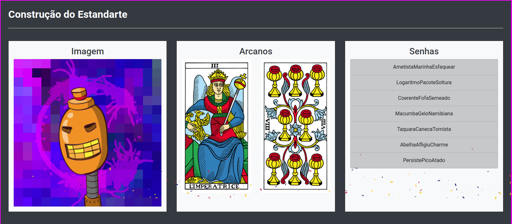
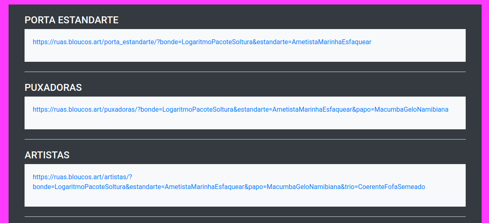

.. _HashFolia:

HashFolia
=========

O HashFolia é um *webapp* que transforma um texto-base em uma Chave para a criação de um :ref:`Estandarte`, que serve de início para um :ref:`Blouco` e também proporciona sua movimentação através das ruas/ambientes conforme a :ref:`Porta-estandarte` e as :ref:`Puxadoras` julguem necessário.

Este projeto está sendo desenvolvido em um `repositório Github <https://github.com/blouco/hash-folia/>`_.

Serviço em testes
-----------------

O endereço `ruas.bloucos.art <https://ruas.bloucos.art>`_ está sendo mantido com a última versão em desenvolvimento. Você pode criar um Estandarte a partir de qualquer palavra, frase, *hash MD5*, ou outro conteúdo:

https://ruas.bloucos.art/hash/SegueOBlouco

Texto -> Hash -> Estandarte
---------------------------

Um texto-base é usado como "semente" (*entropy seed*) para a geração de:

- Uma composição de `visual hashes <https://github.com/drhus/awesome-identicons>`_. Os *hashes* utilizados no momento são o `Robohash <https://robohash.org/>`_, o `Vizhash <https://github.com/sebsauvage/VizHash>`_ e o `arrival_logograms <https://github.com/FlxB2/arrival_logograms>`_).

- Uma tiragem de tarô, no momento feita com um arcano maior e um menor do Tarô de Marsella.

- Um conjunto de frases-senha, usadas tanto como divinação lúdica quanto como direções para a movimentação do :ref:`Blouco`.

