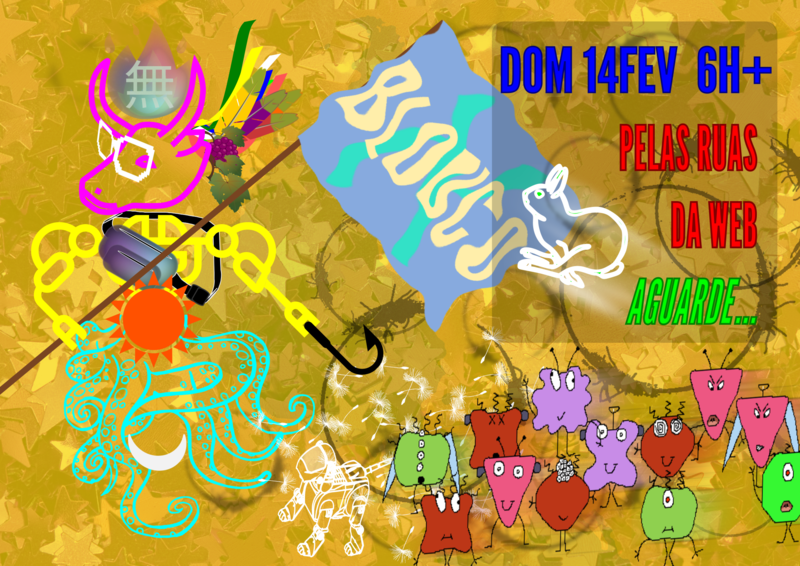

.. OpenBlouco documentation master file, created by
   sphinx-quickstart on Wed Jan 20 16:17:04 2021.
   You can adapt this file completely to your liking, but it should at least
   contain the root `toctree` directive.

Documentação do OpenBlouco
==========================

.. toctree::
   :maxdepth: 2
   :caption: Conteúdo:

   sobre.rst
   manual.rst
   roteiro.rst

-----

Obras usadas na imagem:

- via Wikimedia Commons:
  - Unicode script proposal for Basic Egyptian Hieroglyphs - Nohat . Vectorization: Chabacano, Public domain
  - Emoji One, CC BY-SA 4.0
  - Bunch of grapes, icon Jean Victor Balin, CC0
- 3623 metallic star background - christmashat CC BY 3.0 Unported
- Imagens do Banco de imagens Pixabay
- Hook - Banco de imagens PNG Repo, CC0
- Robot - Banco de imagens SVG Repo, CC0
- Monstrinhos feitos com o visual hash MonsterID, feito por Andreas Gohr
